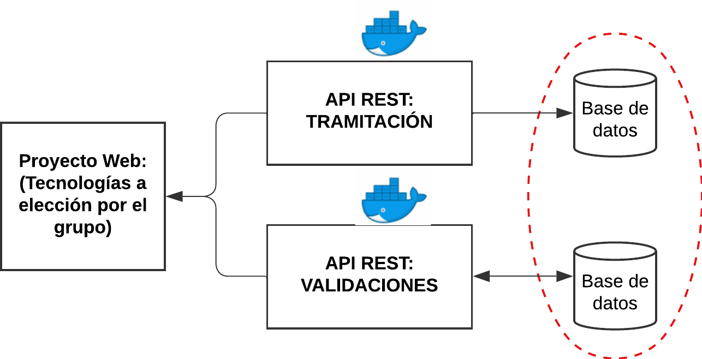
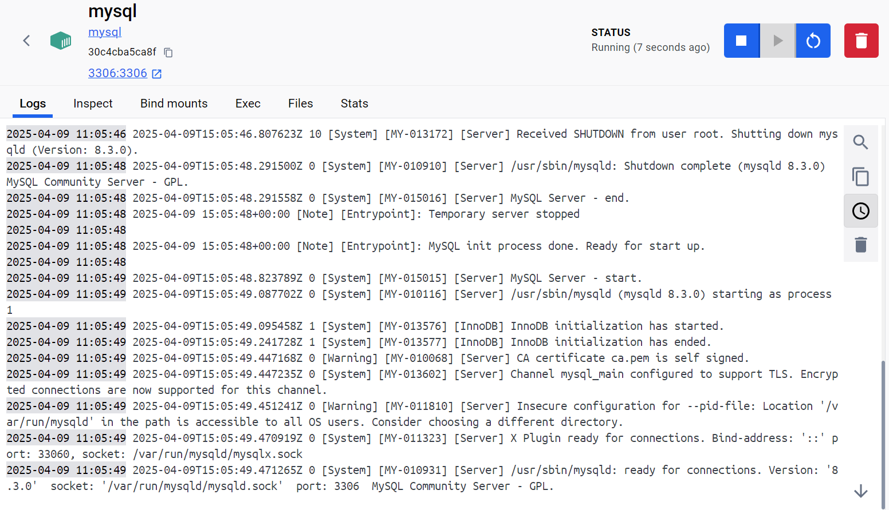
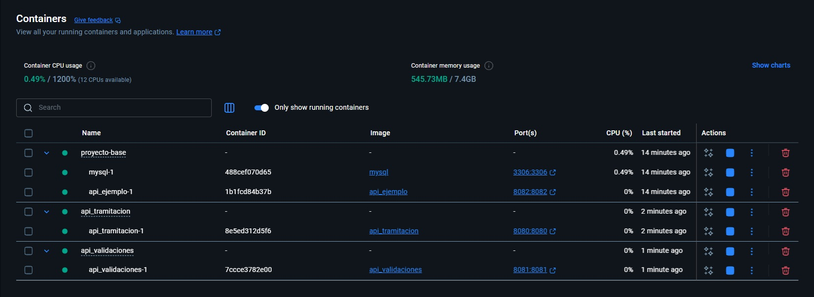
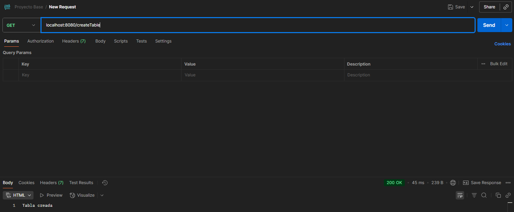
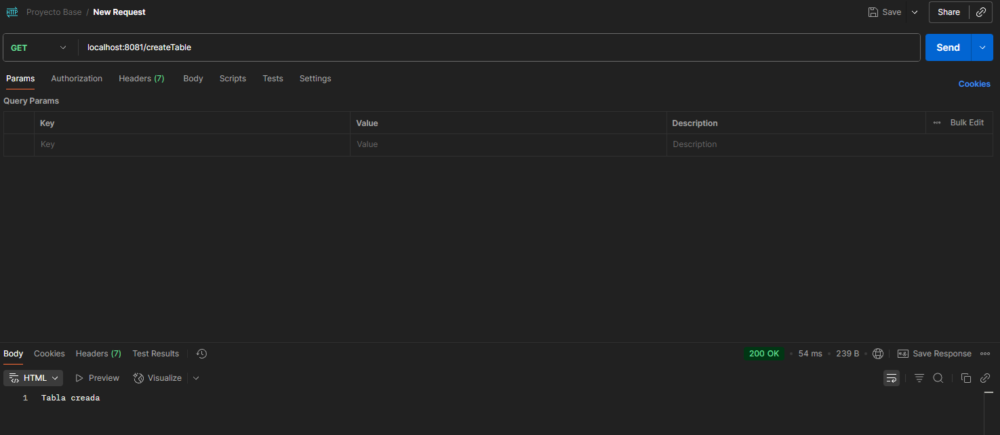
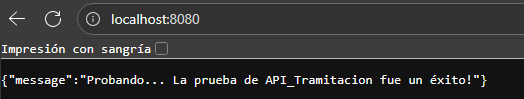
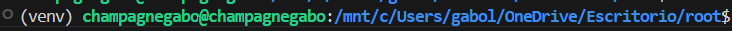
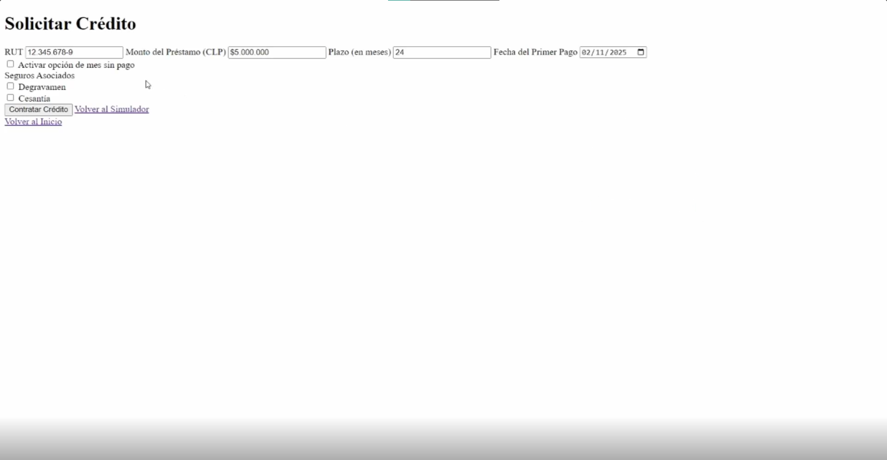
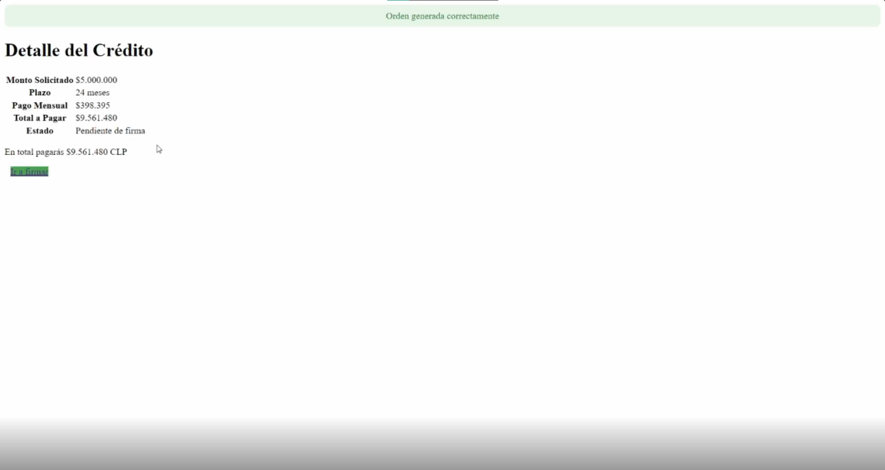
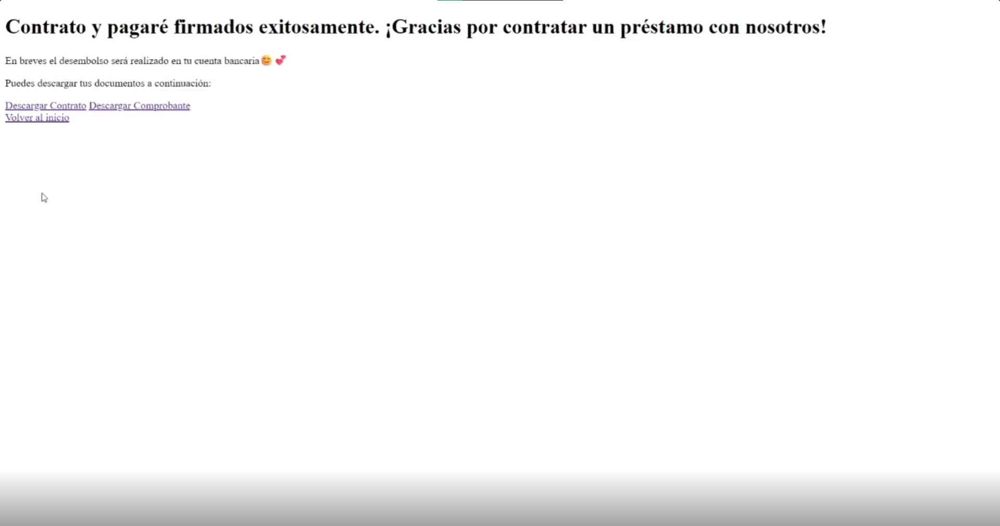

# Grupo 11

Este es el repositorio del grupo 11, cuyos integrantes son:

- Benjamin Cegarra  - ROL: 202373006-8
- Catalina González - ROL: 202373062-9
- Gabriel Lira      - ROL: 202373054-8
- Javier Martínez   - ROL: 202373050-5
    - **Tutor**: Fernanda Araya

# [NUEVO] INF236-2025-2-Proyecto Base

## Aspectos técnicos relevantes

_Todo aspecto relevante cuando para poder usar el proyecto o consideraciones del proyecto base a ser entregado_

_Nada por el momento..._

## Requerimientos

Para utilizar el proyecto base debe tener instalado [Node.js](https://nodejs.org/en), [Docker](https://www.docker.com/) y se recomienda [Postman](https://www.postman.com/) para poder probar los endpoints de las APIs.

## Puntos a Considerar
La solución a desarrollar debe seguir los siguientes lineamientos (imagen referecial al final):
* Se debe considerar al menos dos API's:
    * **API_TRAMITACION:** Con todo lo referido a los pasos de solicitud, evaluación y firmas de documentos.
    * **API_VALIDACIONES:** Con todo lo referido a los procesos de activación, desembolso, cobranza y pagos de cuotas.
Si lo estiman necesario pueden añadir otras API's al proyecto, siempre y cuando cumplan con las reglas detalladas a continuación.
* Cada API contará con una base de datos mysql.
* Las API's deben ser construidas utilizando [Node.js](https://nodejs.org/en), además cuentan con [Express](https://expressjs.com/es/) para facilitar la construcción de estas.
* Las bases de datos deben estar en el mismo contenedor, pero no deben compartirse servicios.
* Cada servicio debe estar en un contenedor.
* El proyecto base solo considera los servicios.
* La tecnología de Frontend la define el grupo.


## Levantando el proyecto
### API_Ejemplo
Iniciaremos levantando la imagen de mysql en docker junto con la API de ejemplo. En una terminal dentro de la **carpeta principal**, escriba el siguiente comando:
```
docker compose up --build
```
La base de datos se inicializará con una tabla con información de países especificada en el archivo "API_EJEMPLO/init/init.sql".

Deben esperar a que los contenedores se inicien en su totalidad, pueden verificar esto en la interfaz de Docker. Luego, podrán probar los endpoints de la API, estos son:
```
GET: localhost:8082/api/pais
POST: localhost:8082/api/pais
PUT: localhost:8082/api/pais/:id
DELETE: localhost:8082/api/pais/:id
```
Sirven para leer, crear, modificar y eliminar registros de la base de datos, respectivamente.

> ⚠️ Cuando escriban ``docker compose up --build``, es normal que aparezcan errores al principio en la terminal. Esto pasa porque la API necesita conectarse a la base de datos. Si bien Docker levanta la BD y luego la api, la primera se levanta mucho más lento que la api! Así que la api lanza errores mientras espera que la base de datos esté lista. Es decir, no entren en pánico y esperen que diga: "Server running!"

### Configuración del Proyecto
Para el desarrollo del proyecto pueden quitar la API Ejemplo del archivo "docker-compose.yml" y eliminar su contenedor. **Noten que el proceso descrito a continuación levanta los contenedores uno a uno. Si lo desean, pueden investigar como juntar todo en el mismo docker-compose (como la API_EJEMPLO y la BD)!**

#### Bases de Datos
Para comenzar, deben tener ejecutándose el contenedor de la base de datos creado con la api de ejemplo, o pueden crearlo desde cero con el comando:
```
docker run -p 3306:3306 --name mysql -e MYSQL_ROOT_PASSWORD=password -d mysql
```



Ahora, crearemos las bases de datos. Para esto debemos entrar en el contenedor, con el siguiente comando:
```
 docker exec -it proyecto-base-main-mysql-1 mysql
```
Donde "proyecto-base-main-mysql-1" es el nombre del contenedor. Si no les coincide pueden revisarlo con "docker ps". Luego, deben ingresar la clave que en este caso es: **password**.

Una vez dentro del contenedor podemos crear las bases de datos:
```
create database Nombre;
```
Donde Nombre, deberá ser sustituido por: BDXX_TRAMITACION y BDXX_VALIDACIONES, donde XX corresponde al número de su grupo.

### API's
#### API_TRAMITACION
Se debe editar el archivo con nombre ".env" que se encuentra en las carpetas "API_TRAMITACION". Este debería contener lo siguiente:
```js
PORT_API = 8080
DB_USER = "root"
DB_PASSWORD = "password"
DB_NAME = "Nombre de la base de datos"
DB_PORT = 3306
DB_HOST = "host.docker.internal"
```
Deben cambiar DB_NAME por el nombre que le pusieron a la base de datos (BDXX_TRAMITACION).

Una vez creado el archivo, se levantará el contenedor de la API. Primero deben entrar en la carpeta de "API_TRAMITACION" y escribir:
```
docker compose up --build -d
```

#### API_VALIDACIONES
Los pasos a seguir son los mismos, únicamente deben fijarse que ahora esta API correrá en el puerto "8081".
```js
PORT_API = 8081
DB_USER = "root"
DB_PASSWORD = "password"
DB_NAME = "Nombre de la base de datos"
DB_PORT = 3306
DB_HOST = "host.docker.internal"
```

Una vez levantado todo, deberían poder ver en Docker todos sus contenedores corriendo:



Pueden probar los siguientes end-points en Postman para verificarlo:
```
GET: localhost:8080/createTable
```



```
GET: localhost:8081/createTable
```



Además, pueden poner en su navegador ```localhost:8080``` y/o ```localhost:8081```, y les debería salir el siguiente mensaje:



### Instrucciones adicionales

    1. Descargar la nueva carpeta PROYECTO-BASE-MAIN

    2. Ejecutar " docker compose up --build " en los siguientes entornos
        2.1 \proyecto-base-main
        2.2 \proyecto-base-main\API_TRAMITACION
        2.3 \proyecto-base-main\API_VALIDACIONES


    3. Actualmente deberían haber 3 contenedores en ejecución, uno por cada API y proyecto-base-main 

    Se eliminó todo rastro de API_EJEMPLOS para que no cause más errores.

### HU005 EN DESARROLLO

    La HU005 se encuentra en proceso, dentro de /public tenemos la carpeta templates que contiene los html necesarios para el simulador y el script de pyton app.py el cual usando flask sirve la página.

> [!WARNING]
> **Inicio de sección obsoleta**
> Esta parte ya no es necesaria, se migró todo el python y flask a JS con .ejs por lo que ya no se
> utiliza un entorno virtual (venv), al final de la sección estarán las instrucciones nuevas.

    Para correr esto se siguieron los siguientes pasos:
        1. Se ejecutó en WSL por lo que se necesitó un entorno virtual para instalar Flask

            1.1 ejecutar: sudo apt install python3.x-venv (con x la versión de python en su dispositivo, 
                si tiene 3.12.3 debe ingresarse python3.12-venv) 
            1.2 ejecutar: python3 -m venv venv
            1.3 ejecutar: source .venv/bin/activate

Su consola debe verse de la siguiente forma para continuar
    ↳ , siendo "root" la carpeta raiz del proyecto

            1.4 ejecutar: pip install flask

        2. Ahora con Flask instalado navegar a la carpeta public: cd proyecto-base-main/public/
        3. ejecutar: python3 app.py
        4. Acceder a http://127.0.0.1:5000 (de todas formas la ip se muestra por consola)

> **Fin de sección obsoleta**

Para correr el proyecto se requieren las siguientes dependencias si es que no están ya instaladas:

    sudo install nodejs
    npm install ejs
    npm install express_session (en caso de no tener express)

Ahora se debe ir al directorio principal en la carpeta del proyecto y ejecutar de la siguiente forma:
    ~/../proyecto-base-main$ node app.js

    Se servirá el index en la dirección: http://localhost:5000/


1. Una vez accedida a la dirección, se verá lo siguiente: 

2. Una vez presionado Iniciar Simulación y colocar el rut se redirigirá a: 

3. Donde una vez ingresado un monto a pedir y plazo se redirigirá a: 

4. Una vez presionado contratar crédito mostrará el detalle: 

5. Que una vez presionado Ir a firmar redirige a  dado que de momento 
   no está implementada la firma digital.


### HU003 PASA A EN DESARROLLO:
    
    Para este hito se intentó implementar una validación de identidad mediante una API, el objetivo es posterior a
    ingresado el rut en el index, cuando se contrata un prestamo simulado se solicita el nombre del usuario, se entrega 
    este nombre y rut a la API la cual chequea en la base de datos que ese nombre y rut coincidan como persona real, y 
    devuelva una respuesta de sí se validó o no su identidad.

    Tuvimos varios problemas que nos llevaron a no poder terminar la parte en la que se cruzan estos datos, de momento se
    reciben correctamente nombre y rut en la pagina web, la API obtiene el json con la query de la base de datos pero no pudimos lograr el paso final de comunicar entre contenedores, lo que nos queda pendiente para el próximo hito.
    
    Dado todo esto el flujo anterior mencionado se detiene en el paso 4. ya que no se cuentan con los permisos para finalizar
    la solicitud.

### Novedades aparte:

    Se movió la HU003 a desarrollo.
    Dado los problemas que surgieron HU001 aún no se moverá a Closed.
    Se corrigió el formato de la HU del hito pasado.
    Se agregó una nueva HU.

### Comienzo desarrollo Hito 5.

    Se instaló cors para comunicar entre puertos npm install cors

## HU004 PASA A EN DESARROLLO:

    Para este Hito 5 se comenzó a desarrollar la firma digital, logramos crear un canvas donde obtener la firma del cliente, faltandonos solamente 
    incluir esto en un PDF descargable con los datos del prestamo.

## Acerca HU003:

    Dado que la validación aún está en proceso no ha sido cerrada esta HU. Por el momento la API funciona de forma que cruza información de 
    la base de datos con la persona que está ingresando, pero nos falta lograr una verificación con contraseña o método de autentificación.

## Avance de código:

    Implementamos una validación en la que un RUT es aceptado únicamente si su dígito verificador corresponde al calculado según la fórmula 
    utilizada por el Registro Civil.

    La HU004 mencionada anteriormente, donde se logró un pop up donde el usuario pueda realizar una firma digital.

## Se incluyó una nueva historia de usuario: 

    HU007: Vista de administrador.
    

### Enjoy!
